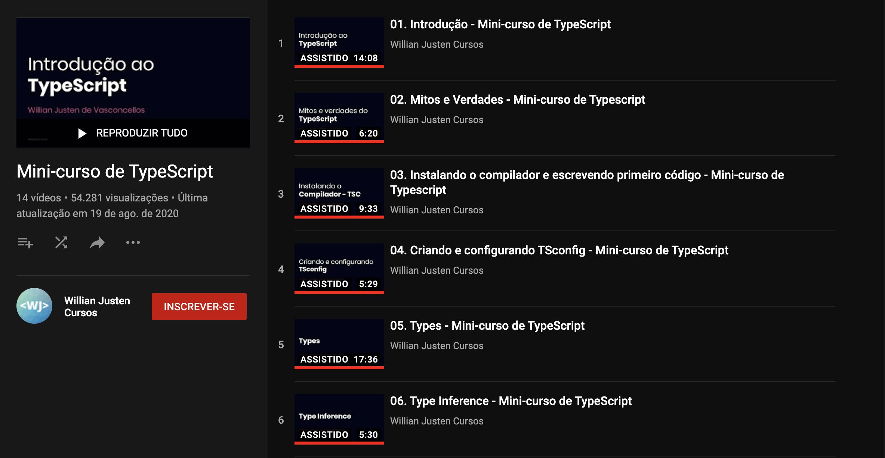

# Typescript Fundamentals Course

This repo is a set of files created to practice and study typescript from [William Justen Course on Youtube](https://www.youtube.com/playlist?list=PLlAbYrWSYTiPanrzauGa7vMuve7_vnXG_).


<div>
  <br>
  
  <br>
</div>

## Installation and Usage

1. Clone the project:

```
git clone git@github.com:dhfuzari/typescript-fundamentals.git
```

2. Navigate to the root project folder

```
cd typescript-fundamentals
```

3. With [NPM](https://www.npmjs.com/) and [TypeScript](https://www.typescriptlang.org/) installed, run:

```
tsc
```

4. Or to use TS `watch` mode

```
tsc watch
```

The generated files will be in the `dist/` folder

## Contributing

Pull requests are welcome. For major changes, please open an issue first to discuss what you would like to change.

## License

[MIT](https://choosealicense.com/licenses/mit/)
